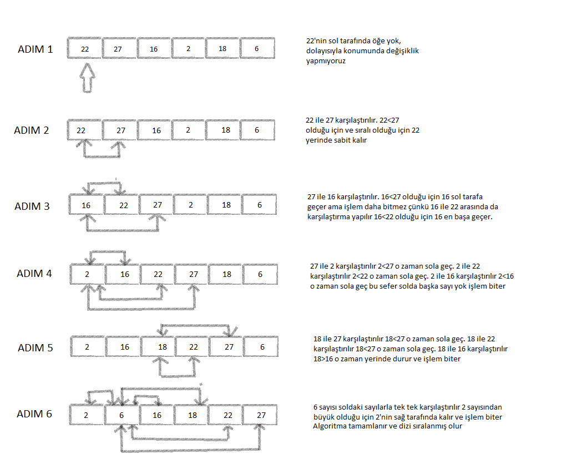

# Insertion-Sort
Insertion Sort yani araya ekleme sıralama algoritması ikinci elemandan başlayarak elemanın kendinden önceki elemanlarla karşılaştırılması suretiyle büyük elemanların dizide sağa doğru kaydırılması işlemlerini tekrar eder. Böylelikle açılan yere o anda sıralanmakta olan eleman yerleşecektir. Yapılan işi toparlayacak olursak öncelikle dizideki ikinci eleman başlangıç elemanı olarak seçilir ve kendisinden önce gelen yani solunda eleman ile kıyaslanır. Eğer birinci eleman ikinci elemandan büyükse yer değiştirirler. Değilse bir sonraki elemana geçilir. İkinci eleman birinci indise alınır ilk eleman ikincisi indise alınır ve üçüncü eleman ile ikinci eleman kıyaslanır.  Bu şekilde dizi elemanlarının hepsine bakılana kadar ve doğru sıralama elde edilene kadar işlem devam eder. 
## [22,27,16,2,18,6] -> Insertion Sort
 Soru 1) Yukarı verilen dizinin sort türüne göre aşamalarını yazınız.
 
Soru 2: Big-O gösterimini yazınız.
 Eleman sayısı n olduğunda, her eleman için en fazla (n-1) karşılaştırma yapılır. Algoritmanın tüm elemanlarını bu şekilde işlemesi gerektiğinde, toplam karşılaştırma sayısı (n-1) + (n-2) + ... + 1 olur, ki bu toplam (n * (n-1) / 2)'ye eşittir.

Big-O gösterimi için en yüksek dereceli terimi göstermemiz lazım. Onun için formülden (n^2) geldiği için gösterimi O(n^2) olur.

Soru 3: Time Complexity: Dizi sıralandıktan sonra 18 sayısı aşağıdaki case'lerden hangisinin kapsamına girer? Yazınız.

1.Average case: Aradığımız sayının ortada olması
2.Worst case: Aradığımız sayının sonda olması
3.Best case: Aradığımız sayının dizinin en başında olması.
Dizi sıralandıktan sonraki hali [2, 6, 16, 18, 22, 27] olacaktır. 18 sayısı dizinin ortasındaki eleman olduğu için cevap "Average case" olacaktır.
